# <h1 align="center">Welcome to GAS Bot Starter 👋</h1>
> A Google App Script-based bot to manage channel-based Slack interactions

Installation instructions
----------

### Installation pre-requisites

- `npm@3+`
- A Google account
- Being administrator of your Slack channel (or knowing the admin as you will have to register the bot on it)
- This repository being cloned somewhere on your filesystem 

### After generation configuration

- Rename directory `slack-bot` to a more meaningful name, as this directory name is going to be used as the name
  of your google app script.
- Rename directory `slack-sheet` to a more meaningful name, as this directory name is going to be used as the name
  of your spreadsheet containing Bot's data.

### Slack Bot Deployment

- `cd` to `slack-bot/` directory then run `npm install` on it
- Authenticate with `clasp` (google app script CLI) with `npx clasp login` (follow instructions)  
  Note: `clasp` is a CLI to manage your Google App Scripts, and it's powered by Google (more infos [here](https://codelabs.developers.google.com/codelabs/clasp/))
- Enable app script API here : https://script.google.com/home/usersettings
- Run `npx clasp create --type api` : a new google app script should be created under your google account.
  Publish keys for this script are going to be set into a `.clasp.json` private file : ⚠️ don't commit this file otherwise
  people will have access to your script !
- Run `npx clasp push` (or `npx clasp push --watch` if you want to edit/auto-deploy some changes made to the script)
  - `Manifest file has been updated. Do you want to push and overwrite?` => Answer "Yes" here
    Files are going to be compiled and pushed into your Google App Script.
- Run `npx clasp deploy` : a new version of your API is going to be made available on the internet
- Open your app script by running `npx clasp open`
  - Once opened, click on the "play" button in order to try to execute doPost function
  - By executing this, you should have an `Authorization required` popup : examine and grant authorizations to your current google account
    Note that if you get a "This application has not been validated (yet) by Google" error, click on `Advanced parameters`
    and proceed to the page (unsecure content)
  - There may have some errors executing doPost : don't worry that's expected (purpose was only to grant authorization to your user)
  - Open the `Publish > Deploy as web app` menu
  - In the popup, copy `Current Web app` URL : this is going to be your HTTP entrypoint for the Bot  
    ⚠️ Avoid sharing this URL too widely, as anyone having access to this URL will be able to control the Bot and cheat :-)
  - Open `File > Project Properties` and select the `Script Properties` tab then create following properties / values :

  | Property name | Value | Meaning |
  |---------------|-------|---------|
  | LOG_ENABLED | true | This can be helpful to see logs, particularly at the beginning |
  | SLACK_CHALLENGE_ACTIVATED | true | Put this to true in order to allow Slack bot challenge |

### Slack instance configuration

- As a Slack administrator, open your Slack App page [here](https://api.slack.com/apps)
- Click on `Create New App` button to create a new Application
  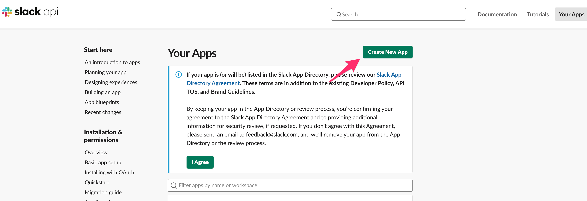
- Fill App Creation popup and reference the Slack Workspace
  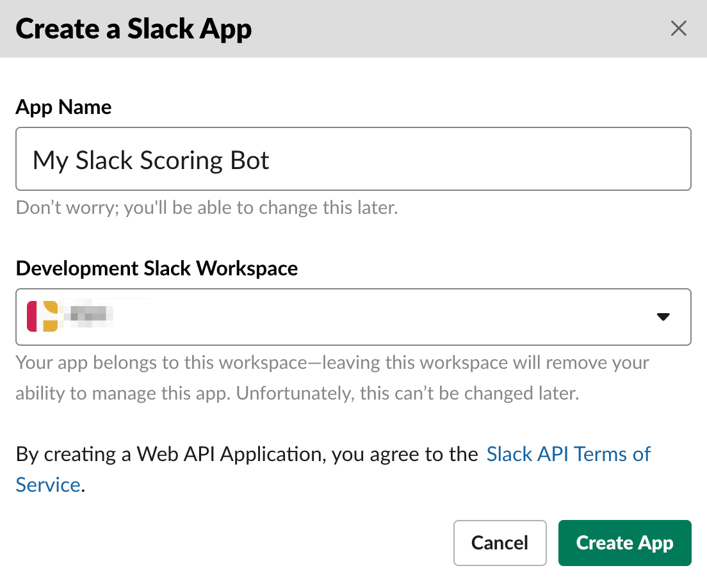
- Once done, and from `Basic Information` screen, open the `Event subscriptions` configuration page
  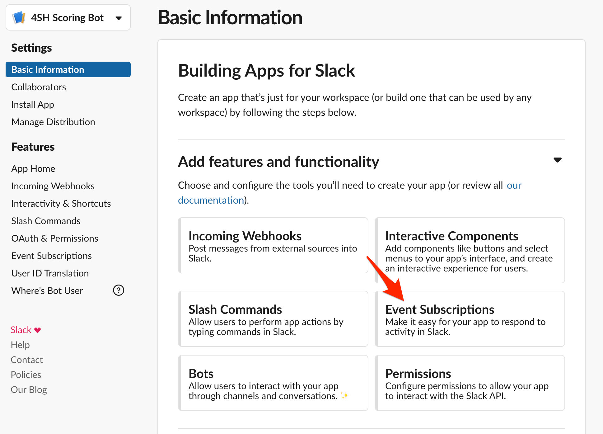
- Activate events and paster Google App Script's Slack Bot URL you copied previously :
  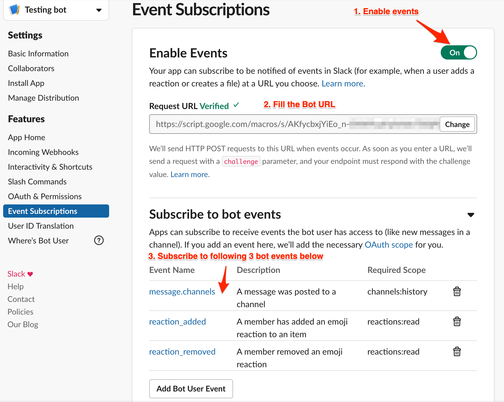
  - Wait for Google App Script challenge verification : if there is a failure, review Google App Script's `SLACK_CHALLENGE_ACTIVATED` project property
   to ensure this is valued to `true` and verify that GAS execution authorization has been granted.
  - Declare 1 `bot events` described in screenshot above : `message.channels`
  - Don't forget to save changes
- Once done, navigate to `OAuth & Permissions` section  
  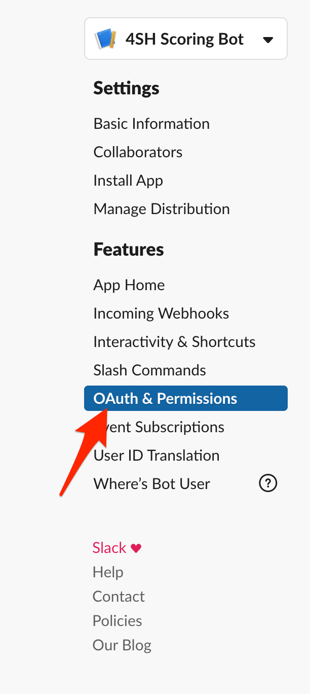
  - In `Scopes` section, there should already be `channels:history` ; Add `channels:join` and `chat:write`
    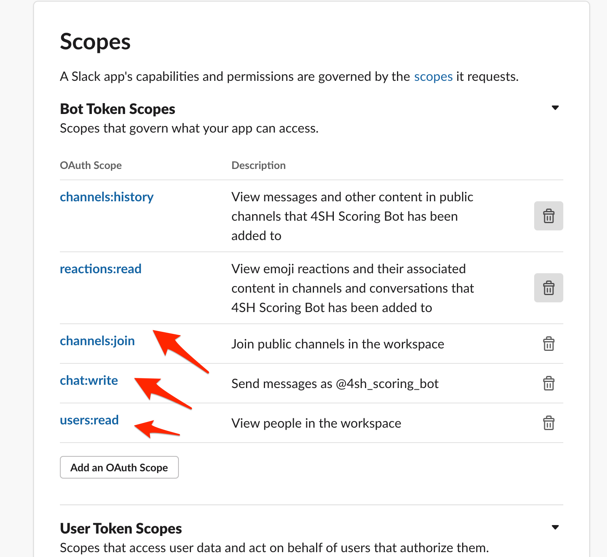
  - Once done, click on `Install App to Workspace` button on top of the screen, and validate permissions configured previously
    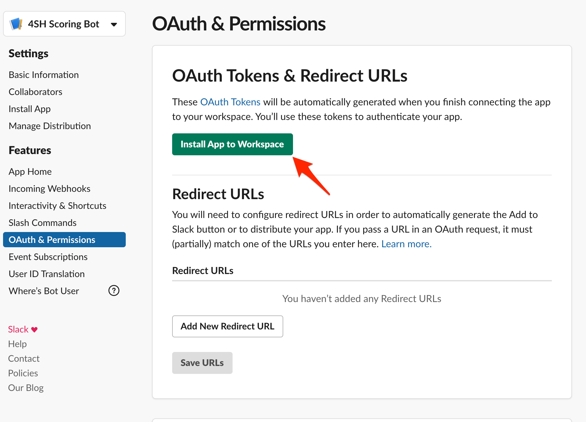
  - Copy generated `Bot User OAuth Access Token` ...
    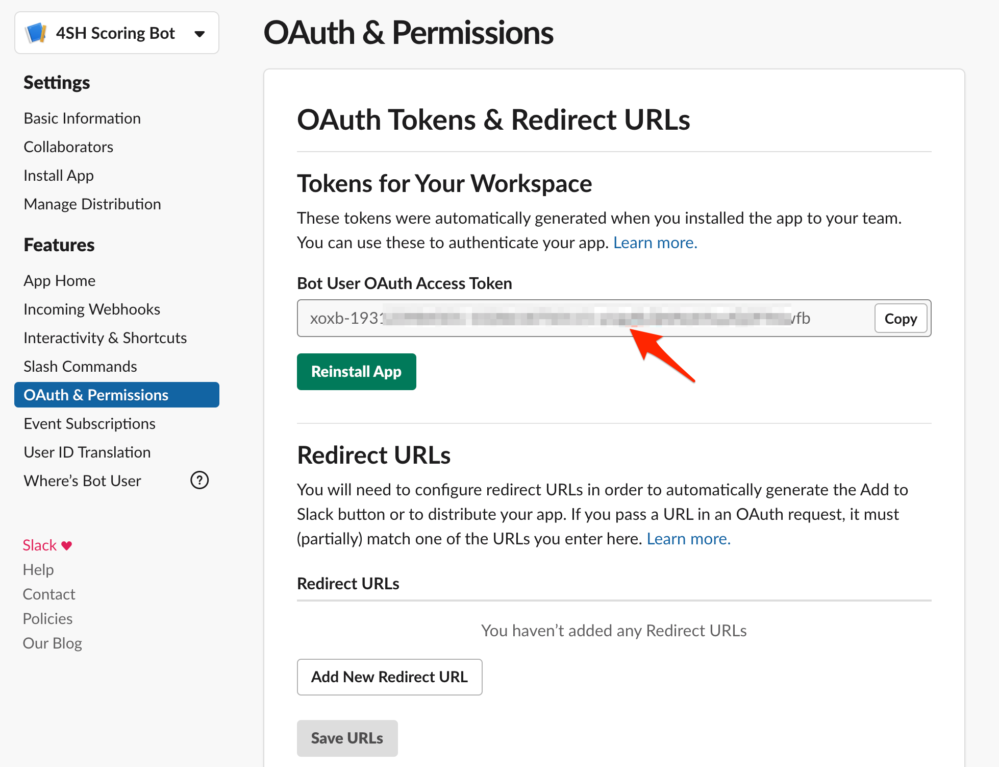
  - ... and paste it into Google App Script's `SLACK_ACCESS_TOKEN` Project Properties. At the same time, disable `SLACK_CHALLENGE_ACTIVATED` flag.
    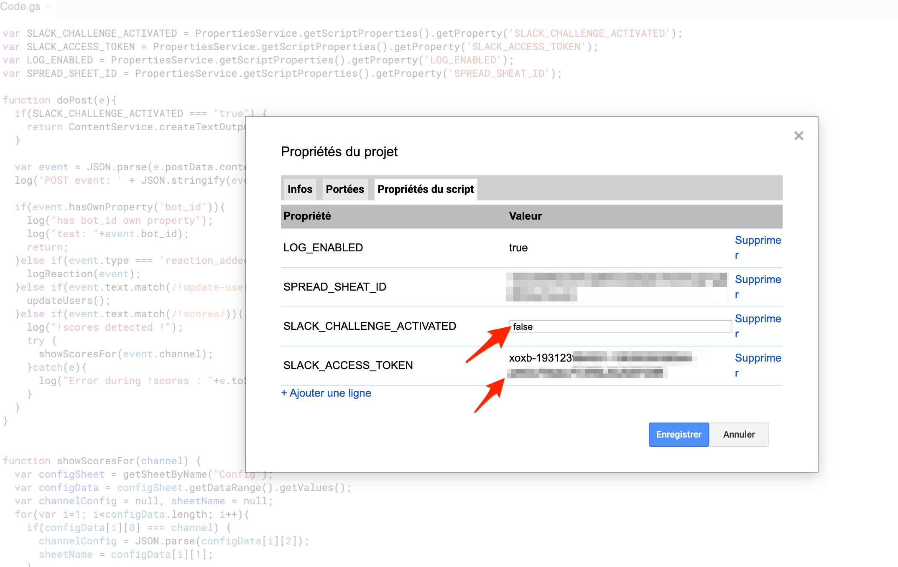

### Spreadsheet config & DB creation

- Move to the `slack-sheet/` directory then run `npm install` on it
- Run `npx clasp create --type sheets` : a new google spreadsheet & app script should be created under your google account.
  - Copy generated google spreadsheet id ...
    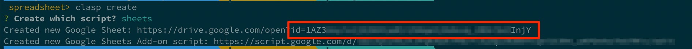
  - ... and paste it into the GAS `SPREADSHEET_ID` project property
    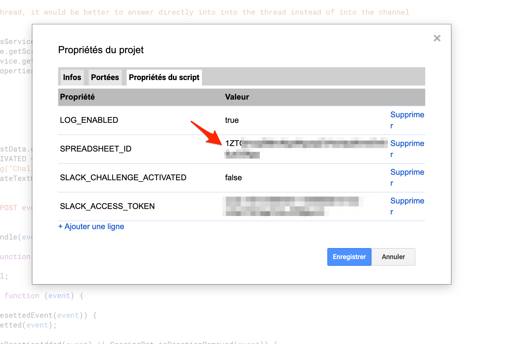
  - Open Google spreadsheet based on the created URL : this will be useful in next steps as we're going to fill this spreadsheet
    with some data.
- Run `npx clasp push` (or `npx clasp push --watch` if you want to edit/auto-deploy some changes made to the script)
  - `Manifest file has been updated. Do you want to push and overwrite?` => Answer "Yes" here
    Files are going to be compiled and pushed into your Google App Script.
- In the spreadsheet, put following formula in a cell : `=SAY_HELLO()` : this will call code defined into your `main/index.ts`
  typescript file and can be useful if you would have to generate complex data into your spreadsheet.

### Slack channel configuration

- Open Slack and invite the bot into one of your channels (prefer to choose a testing channel to begin with) : `/invite @<bot_name>`
- Channel help can be displayed by saying `!help`
 